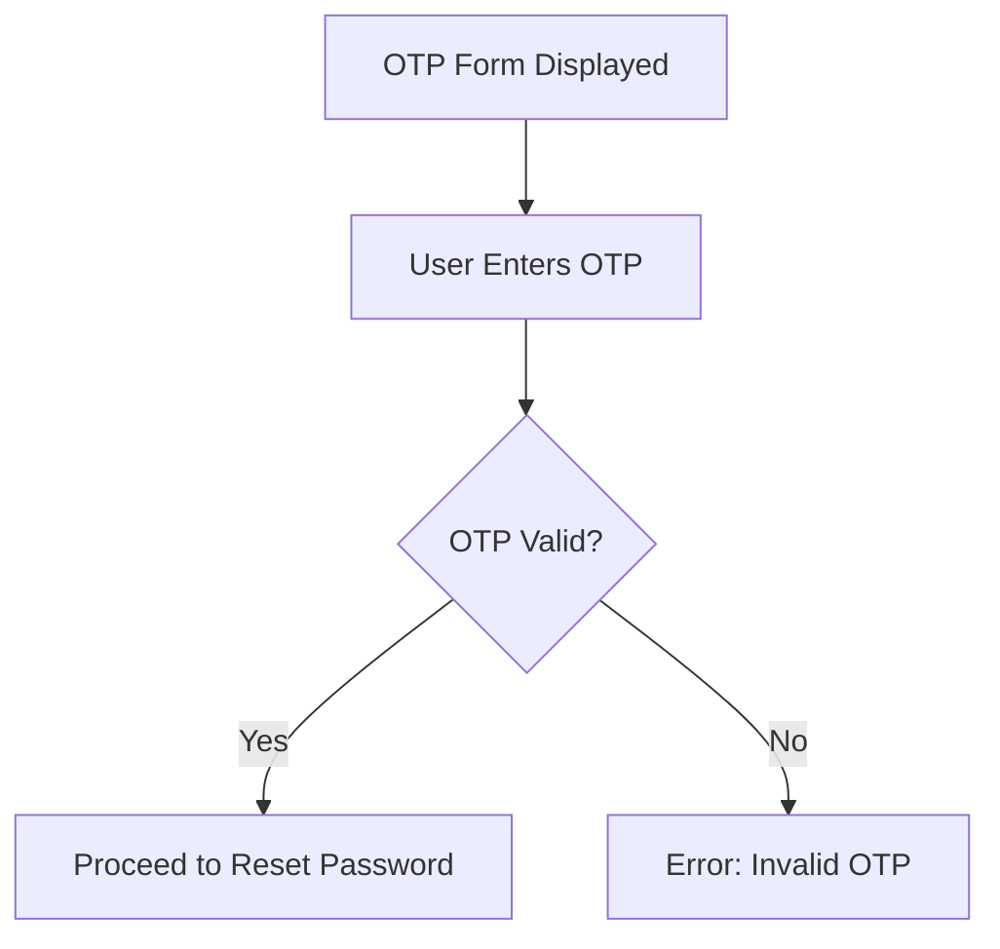
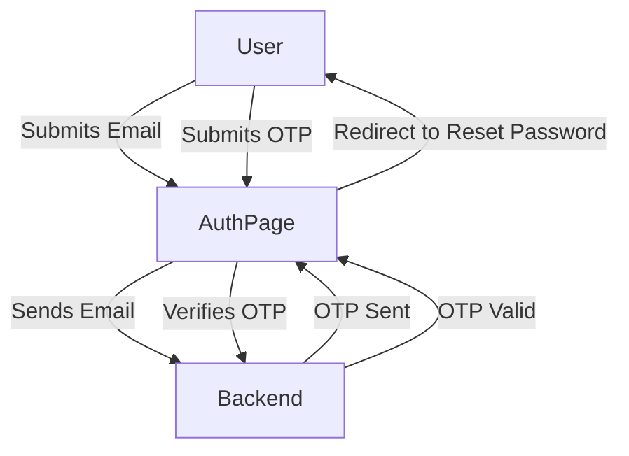

# OscuroBok Backend Codebase

Welcome to the OscuroBok Backend Codebase! This README provides a comprehensive yet simple guide for new contributors to understand the key components and flow of this project. The codebase primarily focuses on user 
- Authentication, 
- OTP verification,
- Role-based access

## Tech Stack

- **Frontend**: Next.js, React, Redux
- **Styling**: Material-UI (MUI) components, custom styles
- **API Requests**: Axios (via services)
- **State Management**: Redux Toolkit
- **Form Handling**: Formik & Yup (for validation)
- **Authentication**: OTP-based (Simulated)

---

### Role-Based Routing
- Based on the user type (Admin/User), redirection occurs after login using a single API call.

### Workflow Diagram

### Project Flow

    
# To clone a code from a particular branch, use:
* git clone -b branch_name https://github.com/OscuroBok/OscuroBok_dashboard_FE.git

* # To clone a code from a branch, use:
* git clone https://github.com/OscuroBok/OscuroBok_dashboard_FE.git

# Commands used:
* npm install
* npm run db:migrate_all ->  Migrates all Schemas and creates tables in Database
* npm run seed:role (if u don't see the message, "The seed command has been executed") -> This command will insert the Admins roles into DB
* npm run seed:admin(Inserts the Super Admin credentials and data in DB)
* npm start
